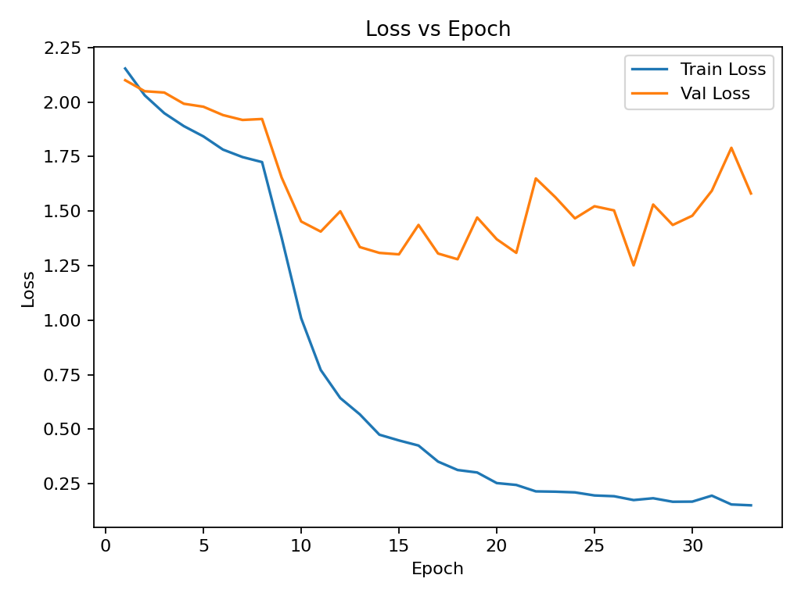
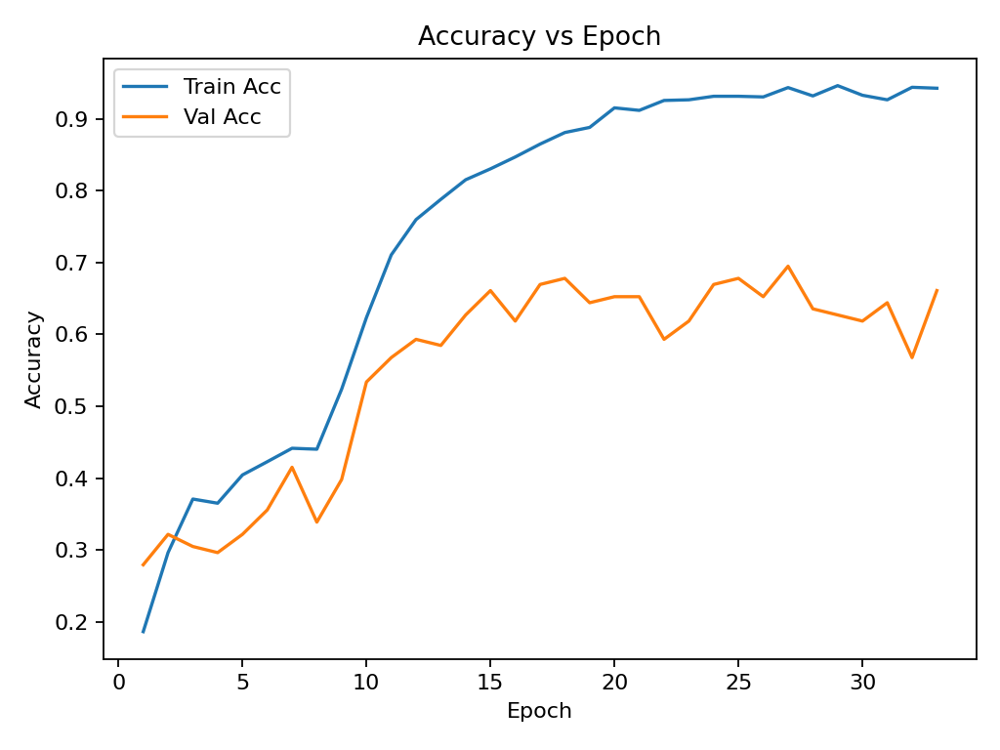
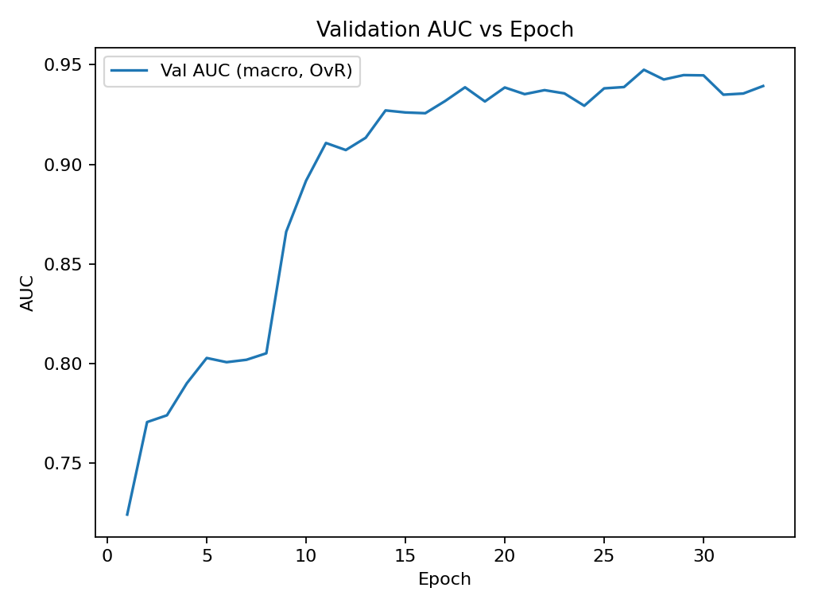
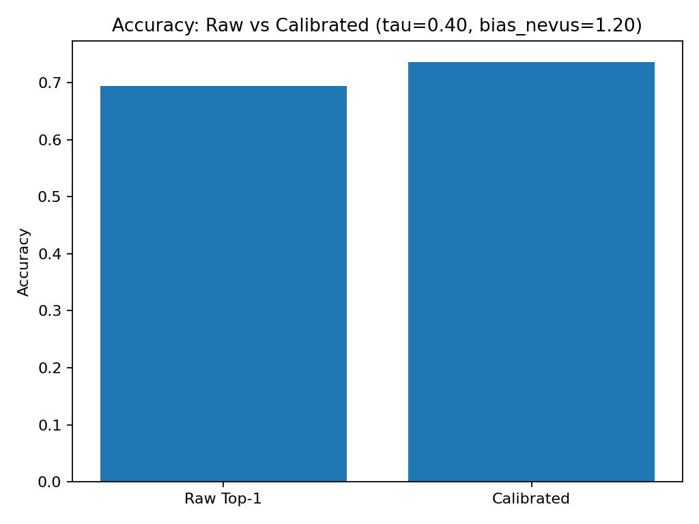
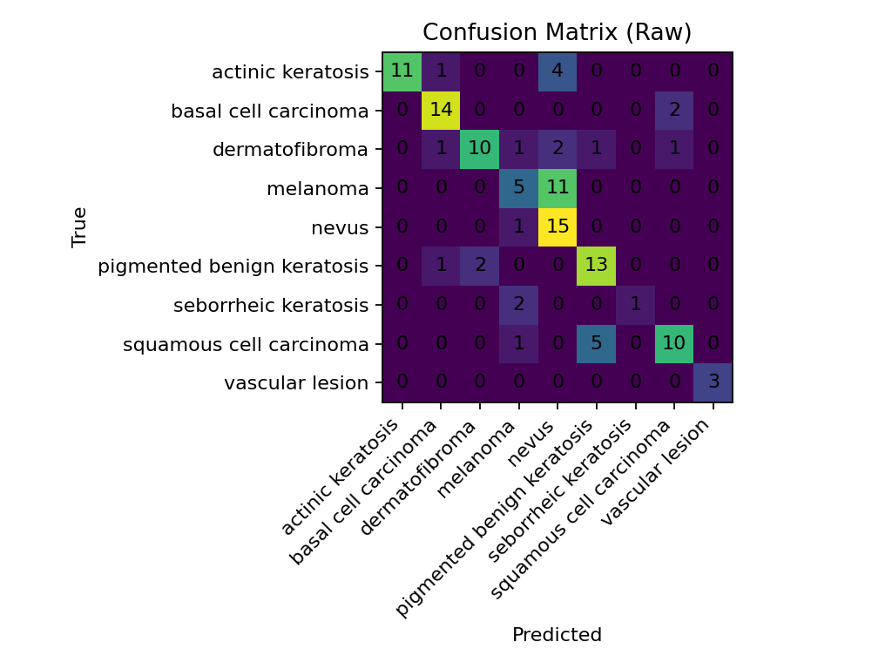

# Visual_In_Computing_PBL_2025
# ISIC ViT/MAE Training & Evaluation

Two scripts using `timm` + PyTorch to train and evaluate an ISIC multi-class classifier with:
- **Class imbalance handling** (weighted sampler / class weights)
- **Two-stage training** (linear probe → full fine-tuning)
- **AUC metrics**
- **Decision calibration** based on the validation set (prior strength `τ` + a negative bias for the *nevus* class)

---

## Directory Layout

```
project/
├─ train_isic_mae.py
├─ eval_isic.py
├─ checkpoints/
└─ data/
└─ ISIC_dataset/
├─ Train/
│ ├─ actinic keratosis/ *.jpg
│ ├─ basal cell carcinoma/ *.jpg
│ └─ ...
└─ Test/
├─ actinic keratosis/ *.jpg
├─ basal cell carcinoma/ *.jpg
└─ ...
```

> `ImageFolder` convention: each subfolder name is a class label. `Train` and `Test` must have the same set of classes.

---

## Dependencies

- Python 3.9+
- PyTorch (CUDA optional)
- `torchvision`, `timm`
- Optional: `scikit-learn` (for ROC-AUC / PR-AUC; if missing, the code falls back to accuracy only)

Install (with [uv](https://github.com/astral-sh/uv)):

```bash
uv pip install torch torchvision timm scikit-learn
```
## Training (Two-Stage)

### Quick Start
```bash
uv run train_isic_mae.py \
  --root data/ISIC_dataset \
  --model vit_base_patch16_224.mae \
  --balance weighted_sampler \
  --probe-epochs 8 --ft-epochs 25 \
  --probe-lr 3e-4 --ft-lr 1e-5 \
  --batch-size 32 --num-workers 4 \
  --amp \
  --outdir checkpoints
  ```
### Key Arguments
- --model: e.g. vit_base_patch16_224.mae (MAE pretrain) or vit_base_patch16_224 (supervised pretrain; recommended as a baseline).

- --balance: none | weighted_sampler (recommended) | class_weight.

- --probe-epochs / --ft-epochs: epochs for linear probe and fine-tuning.

- --probe-lr / --ft-lr, --weight-decay: optimizer (AdamW) settings.

- --amp: enable mixed precision on CUDA (auto-disabled on MPS/CPU).

- --img-size 224 --eval-resize 256: classic 256→224 (keep aspect ratio + center crop).

### Outputs
checkpoints/best_probe.pt: best model after the probe stage.

checkpoints/best_finetune.pt, checkpoints/last_finetune.pt: best/last model from the fine-tuning stage.

Logs include Train/Val Loss, Acc, and (if scikit-learn is installed) macro ROC-AUC.

## Evaluation & Decision Calibration
Run:

```bash
uv run eval_isic.py \
  --root data/ISIC_dataset \
  --ckpt checkpoints/best_finetune.pt \
  --model vit_base_patch16_224.mae
  ```
What it does:

Evaluates on Test/ and prints Top-1 / Top-2 / Macro ROC-AUC / Macro PR-AUC and the raw confusion matrix.

Searches over prior strength tau ∈ [0, 2] and a negative bias for the nevus class bias_nevus ∈ [0, 1.5] to maximize accuracy on the validation distribution.

Saves checkpoints/decision_calibration.json:
```json
{
  "best_tau": 0.90,
  "bias_nevus": 0.50,
  "prior": [p0, p1, ..., p8]
}
```
Applies that decision rule and prints post-calibration accuracy and calibrated confusion matrix for an immediate before/after comparison.

## Using Calibration at Inference
```python
import json, numpy as np, torch

# logits: [B, C] from your model (pre-softmax)
calib = json.load(open("checkpoints/decision_calibration.json"))
prior = np.array(calib["prior"], dtype=np.float32)
tau = float(calib["best_tau"])
bias_nevus = float(calib.get("bias_nevus", 0.0))
nevus_idx = class_names.index("nevus")  # class_names = ds.classes from ImageFolder

logits_adj = logits - torch.from_numpy(np.log(prior + 1e-12)).to(logits.dtype) * tau
logits_adj[:, nevus_idx] -= bias_nevus
pred = logits_adj.argmax(1)  # final labels
```
>If deployment priors differ from validation priors, recompute prior and re-tune tau on a validation set matching deployment.

## Results

**Dataset:** ISIC (9 classes)  
**Backbone:** `vit_base_patch16_224.mae` (timm)  
**Training:** weighted sampler; two-stage (linear probe 8 epochs → fine-tune 25 epochs)

### Key Metrics (Test)

| Metric | Value |
|---|---:|
| Raw Top-1 Accuracy | **0.695** |
| Top-2 Accuracy | 0.881 |
| Macro ROC-AUC (OvR) | **0.947** |
| Macro PR-AUC | 0.820 |
| Calibrated Top-1 Accuracy | **0.737** |
| Best τ (prior strength) | 0.40 |
| Bias (nevus) | 1.20 |

Decision calibration (subtracting `τ·log(prior)` and a small negative bias on *nevus*) improved top-1 accuracy from **69.5% → 73.7%**.

### Curves

- **Loss vs. Epoch**  
  

- **Accuracy vs. Epoch**  
  

- **Validation AUC vs. Epoch**  
  

### Raw vs. Calibrated Accuracy



### Confusion Matrices (Test)

- **Raw (argmax)**  
  

- **After Calibration (τ + bias\_nevus)**  
  

### Reproducibility

Parsed artifacts:
- `plots/parsed_train.json` — parsed per-epoch train/val metrics  
- `plots/parsed_eval.json` — parsed test metrics, calibration params, and matrices  

Logs:
- `plots/train_mae.log` — stdout from `train_isic_mae.py`  
- `plots/eval_mae.log` — stdout from `eval_isic.py`  

> To regenerate figures:
> ```bash
> uv run plot_isic_results.py \
>   --train_log plots/train_mae.log \
>   --eval_log plots/eval_mae.log \
>   --outdir plots
> ```
